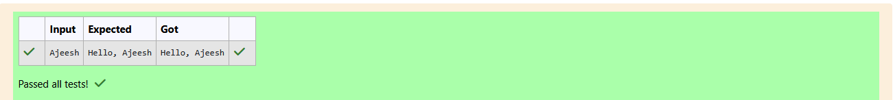

# Ex.No:1(A) INTRODUCTION TO JAVA PROGRAMMING, DATA TYPES, VARIABLES AND OPERATORS

## QUESTION:
A shop keeper would like to welcome their customers with their name.
Write a java program to get name from the user (String) and print it.

## AIM:
To write a Java program that takes a user’s name as input and displays a greeting message using Scanner

## ALGORITHM :
1. Start the program.

2. Create a Scanner object to read input from the user.

3. Prompt the user to enter their name.

4. Read the input string using next().

5. Concatenate the string "Hello, " with the entered name.

6. Display the greeting message on the screen.

7. End the program.


## PROGRAM:
 ```
/*
Program to implement variables and Operators using Java
Developed by: Elavarasan M
RegisterNumber: 212224040083
*/
```


## Sourcecode.java:


```java
import java.util.Scanner;
public class Main{
    public static void main(String[] args){
        Scanner input = new Scanner(System.in);
        String name = input.next();
        System.out.print("Hello, "+name);
    }
}
```


## OUTPUT:




## RESULT:

The program successfully reads the user’s name and prints a greeting.