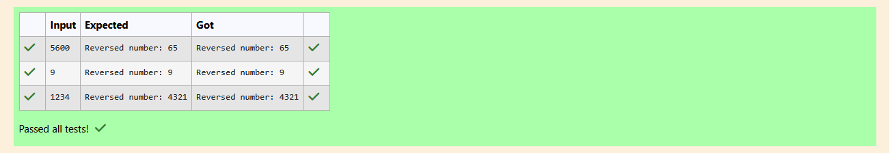

# Ex.No:1(C) LOOPING STATEMENT

## QUESTION:

Write a Java program to reverse a number using a while loop. For example, if the input is 1234, the output should be 4321

## AIM:

To write a Java program that reads an integer and prints its digits in reverse order.

## ALGORITHM :

1. Start the program.
2. Create a Scanner object to read input from the user.
3. Read an integer num.
4. Initialize reversed = 0 and copy = num.
5. Repeat while copy > 0:
    * Extract the last digit using copy % 10.
    * Update reversed = reversed * 10 + digit.
    * Remove the last digit from copy using copy / 10.
6. After the loop ends, print "Reversed number: " followed by reversed.
7. End the program.


## PROGRAM:
 ```
/*
Program to implement a Looping Statement using Java
Developed by: Elavarasan M
RegisterNumber:  212224040083
*/
```

## SOURCE CODE:

```java
import java.util.Scanner;
public class Main{
    public static void main(String[] args){
        Scanner input = new Scanner(System.in);
        int num = input.nextInt();
        int reversed = 0,copy = num;
        while(copy>0){
            reversed = reversed * 10 + (copy%10);
            copy/=10;
        }
        System.out.print("Reversed number: "+reversed);
    }
}
```

## OUTPUT:



## RESULT:

The program successfully reverses the digits of the entered number.