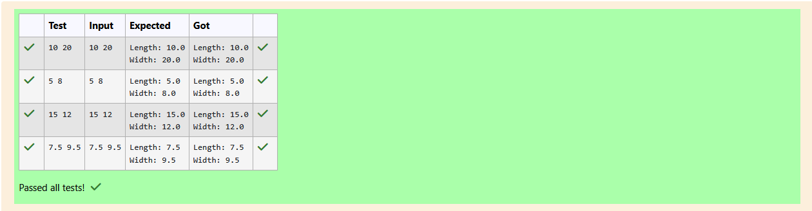

# Ex.No:2(C) ACCESS SPECIFIERS

## QUESTION:

Write a Java program to create a class called Rectangle with private instance variables length and width. Provide public getter and setter methods to access and modify these variables

## AIM:

To write a Java program that demonstrates the use of getter and setter methods in a class and calculates the area of a rectangle.

## ALGORITHM :

1. Define a class Rectangle with private instance variables length and width.
2. Provide getter and setter methods for both variables to access and modify them.
3. Define a method calculateArea() that returns the product of length * width.
4. In the main method:
   * Create a Scanner object to read input.
   * Read values for length and width.
   * Create an object of Rectangle.
   * Use setter methods to assign values to the object.
   * Use getter methods to display the values of length and width.
   * Call calculateArea() to compute and display the area of the rectangle.
5. End the program.


## PROGRAM:
 ```
/*
Program to implement a Access Specifiers using Java
Developed by: Elavarasan M
RegisterNumber:  212224040083
*/
```

## SOURCE CODE:


```java
import java.util.Scanner;
class Rectangle {
    // Private instance variables
    private double length;
    private double width;
    // Getter and Setter for length
    public double getLength() {
        return length;
    }
    public void setLength(double length) {
        this.length = length;
    }
    // Getter and Setter for width
    public double getWidth() {
        return width;
    }
    public void setWidth(double width) {
        this.width = width;
    }
    // Method to calculate area
    public double calculateArea() {
        return length * width;
    }
}
public class Main{
    public static void main(String[] args){
        Scanner input = new Scanner(System.in);
        double length = input.nextDouble();
        double width = input.nextDouble();
        Rectangle obj = new Rectangle();
        
        obj.setLength(length);
        obj.setWidth(width);
        System.out.printf("Length: %.1f\n",obj.getLength());
        System.out.printf("Width: %.1f\n",obj.getWidth());
    }
}
```


## OUTPUT:



## RESULT:
The program successfully demonstrates encapsulation using getter and setter methods and calculates the area of a rectangle.