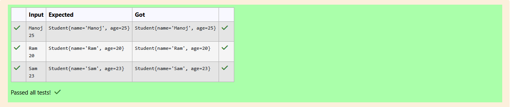

# Ex.No:2(D) VARIABLE SCOPE AND CONSTRUCTOR

## QUESTION:
Write a class that uses a constructor to initialize variables and overrides toString() method.

## AIM:
To write a Java program that demonstrates the use of a parameterized constructor and the toString() method to display student details.

## ALGORITHM :
1. Define a class Student with two attributes: name and age.
2. Create a parameterized constructor that initializes these attributes using this keyword.
3. Override the toString() method to return a formatted string containing the student’s details.
4. In the main method:
    * Create a Scanner object to read input.
    * Read the student’s name and age from the user.
    * Create a Student object using the parameterized constructor.
    * Print the object, which automatically calls the overridden toString() method.
5. End the program.


## PROGRAM:
 ```
/*
Program to implement a Variable scope and Constructor using Java
Developed by: Elavarasan M
RegisterNumber:  212224040083
*/
```

## SOURCE CODE:


```java
import java.util.Scanner;
class Student{
    String name;
    int age;
    Student(String name,int age){
        this.name = name;
        this.age = age;
    }
    
    public String toString(){
        return "Student{name='" + name + "', " + "age=" + age + "}";
    }
}
public class prog{
    public static void main(String[] args){
        Scanner input = new Scanner(System.in);
        String name = input.next();
        int age = input.nextInt();
        
        Student obj = new Student(name,age);
        System.out.println(obj);
    }
}

```


## OUTPUT:



## RESULT:
The program successfully creates a student object using a parameterized constructor and displays its details using the toString() method.