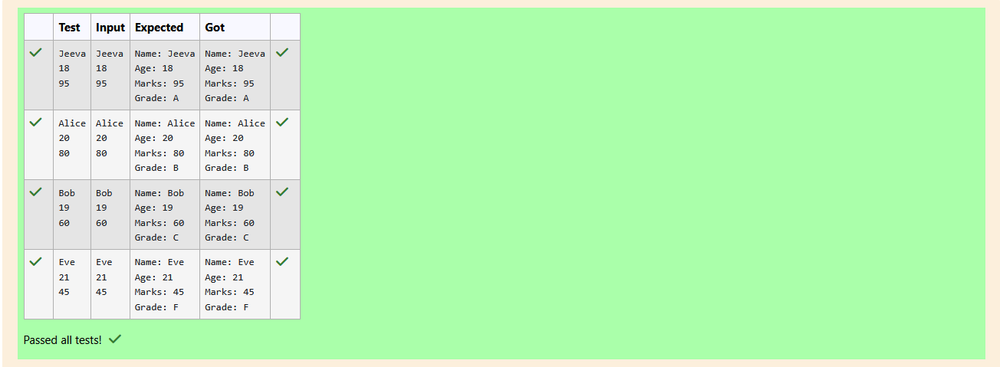

# Ex.No:3(A) INHERITANCE AND AGGREGATION

## QUESTION:
Create a Super class Person with fields name and age. Create a subclass Student that inherits from Person and adds a field marks (integer). Implement a method in Student called calculateGrade() which returns the grade based on the marks:

Marks ≥ 90: Grade A

Marks ≥ 75 and < 90: Grade B

Marks ≥ 50 and < 75: Grade C

Marks < 50: Grade F


## AIM:
To write a Java program that demonstrates inheritance by creating a Person class and extending it with a Student class that includes marks and grade calculation.

## ALGORITHM :

1. Define a base class Person with attributes name and age.
2. Create a constructor in Person to initialize these attributes.
3. Define a derived class Student that extends Person and adds an attribute marks.
4. Create a constructor in Student that calls the Person constructor using super() and initializes marks.
5. Define a method display() in Student to print the student’s details.
6. Define a method calculateGrade() in Student that:
    * Prints "Grade: A" if marks ≥ 90.
    * Prints "Grade: B" if marks ≥ 75 and < 90.
    * Prints "Grade: C" if marks ≥ 50 and < 75.
    * Prints "Grade: F" if marks < 50.
7. In the main method:
   * Create a Scanner object to read input.
   * Read name, age, and marks.
   * Create a Student object using the constructor.
   * Call display() to show details.
   * Call calculateGrade() to show grade.
8. End the program.


## PROGRAM:
 ```
/*
Program to implement a Inheritance and Aggregation using Java
Developed by: Elavarasan M
RegisterNumber:  212224040083
*/
```

## SOURCE CODE:

```java 
import java.util.*;
class Person{
    String name;
    int age;
    Person(String name,int age){
        this.name = name;
        this.age = age;
    }
    
}

class Student extends Person{
    int marks;
    Student(String name,int age,int marks){
        super(name,age);
        this.marks = marks;
    }
    void display(){
        System.out.println("Name: "+name);
        System.out.println("Age: "+age);
        System.out.println("Marks: "+marks);
    }
    void calculateGrade(){
        if(marks>=90){
            System.out.println("Grade: A");
        }
        else if(marks>=75 && marks<90){
            System.out.println("Grade: B");
        }
        else if(marks>=50 && marks<75){
            System.out.println("Grade: C");
        }
        else if(marks<50){
            System.out.println("Grade: F");
        }
    }
}
public class Main{
    public static void main(String[] args){
        Scanner input = new Scanner(System.in);
        String name = input.next();
        int age = input.nextInt();
        int marks = input.nextInt();
        Student s1 = new Student(name,age,marks);
        s1.display();
        s1.calculateGrade();
    }
}
```


## OUTPUT:




## RESULT:
The program successfully demonstrates inheritance and grade calculation.