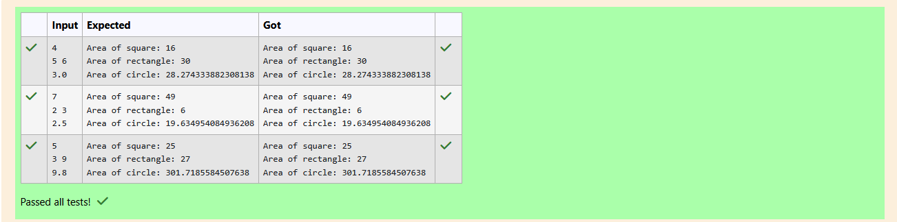

# Ex.No:3(b) POLYMORPHISM

## QUESTION:
Write a Java program that calculates the area of different shapes using method overloading. Create a class AreaCalculator with:

area(int side) for square

area(int length, int breadth) for rectangle

area(double radius) for circle


## AIM:

To write a Java program that demonstrates method overloading by calculating the area of a square, rectangle, and circle using different parameter lists.

## ALGORITHM :
1. Define a class AreaCalculator.
2. Create three overloaded methods named area:
    * area(int side) → calculates area of a square (side * side).
    * area(int length, int breadth) → calculates area of a rectangle (length * breadth).
    * area(double radius) → calculates area of a circle (π * radius * radius).
3. In the main method:
    * Create a Scanner object to read input values.
    * Read side, length, breadth, and radius.
    * Create an object of AreaCalculator.
    * Call each overloaded area method with the respective inputs.
4. Display the results.
5. End the program.


## PROGRAM:
 ```
/*
Program to implement a Polymorphism using Java
Developed by: Elavarasan M
RegisterNumber:  212224040083
*/
```

## SOURCE CODE:


```java
import java.util.*;
class AreaCalculator {
    void area(int side) {
        int result = side * side;
        System.out.println("Area of square: " + result);
    }

    void area(int length, int breadth) {
        int result = length * breadth;
        System.out.println("Area of rectangle: " + result);
    }

    void area(double radius) {
        double result = Math.PI * radius * radius;
        System.out.println("Area of circle: " + result);
    }
}
public class prog{
    
    public static void main(String[] args) {
        AreaCalculator calc = new AreaCalculator();
        Scanner input = new Scanner(System.in);
        int side = input.nextInt();
        int length = input.nextInt();
        int breadth = input.nextInt();
        double radius = input.nextDouble();
        
        calc.area(side);
        calc.area(length,breadth);
        calc.area(radius);
    }
}
```


## OUTPUT:



## RESULT:

The program successfully demonstrates method overloading and calculates areas of different shapes.