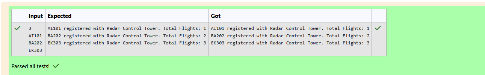

# Ex.No:4(B)  IMPLEMENT SOLID PRINCIPLES IN JAVA PROGRAM 

## QUESTION:
At an international airport, only one Radar Control Tower exists. This tower is responsible for handling all flight communications regardless of how many flights are coming in. Each incoming flight must contact this tower to register its approach.

To ensure safety and consistency, all flights must communicate with the same instance of the tower. If multiple towers are created, it may lead to inconsistent instructions — a huge risk in aviation.

Your task is to simulate this system using the Singleton pattern.

Key Hint (Hidden in Story):
Only one control tower object should exist.

Every flight contacting it should register its name.

You should log the order of flights that contacted the tower.

Input Format:
First line: Integer n – number of incoming flights

Next n lines: Each line contains the flight name.

Output Format:
For each flight, print:

[FlightName] registered with Radar Control Tower. Total Flights: [count]

## AIM:

To write a Java program that simulates a Radar Control Tower using the Singleton design pattern, ensuring only one tower instance handles all flight communications and logs the order of flights.
## ALGORITHM :

1. Define a class RadarControlTower with:
    * A private static instance variable instance.
    * A private constructor to prevent multiple object creation.
    * A static method getInstance() that returns the single tower instance.
    * A method registerFlight(String flightName) that increments the flight counter and returns the total flights registered.
2. In the main class prog:
    * Create a Scanner object to read input.
    * Read the number of flights n.
    * For each flight name:
        * Get the singleton instance of RadarControlTower.
        * Call registerFlight() with the flight name.
        * Print the message: [FlightName] registered with Radar Control Tower. Total Flights: [count]
3. End the program.


## PROGRAM:
 ```
/*
Program to implement a SOLID Principles in Java Program
Developed by: Elavarasan M
RegisterNumber:  212224040083
*/
```

## SOURCE CODE:


```java
import java.util.*;
class RadarControlTower {
    private static RadarControlTower instance;
    private int flightCount = 0;

    private RadarControlTower() {}

    public static RadarControlTower getInstance() {
        if (instance == null) {
            instance = new RadarControlTower();
        }
        return instance;
    }
    public int registerFlight(String flightName) {
        flightCount++;
        return flightCount;
    }
}

public class prog {
    public static void main(String[] args) {
        Scanner sc = new Scanner(System.in);
        int n = sc.nextInt();
        sc.nextLine();  // consume newline

        for (int i = 0; i < n; i++) {
            String flight = sc.nextLine();
            RadarControlTower tower = RadarControlTower.getInstance();
            int total = tower.registerFlight(flight);
            System.out.println(flight + " registered with Radar Control Tower. Total Flights: " + total);
        }
    }
}

```


## OUTPUT:



## RESULT:
The program ensures only one Radar Control Tower object exists and logs the order of flights.