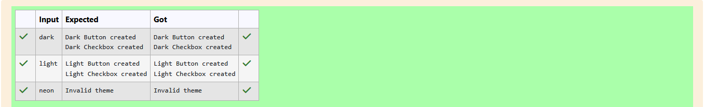

# Ex.No:4(D) DESIGN PATTERN -- ABSTRACT FACTORY

## QUESTION:
You’re creating a cross-platform UI tool using the Abstract Factory pattern. Implement factories to create Button and Checkbox for "dark" and "light" themes. Let the user choose the theme, then generate UI components and display their types

## AIM:
To write a Java program that demonstrates the Abstract Factory Design Pattern by creating UI components (Button, Checkbox) for different themes (Dark and Light).

## ALGORITHM :

1. Define two interfaces:
    * Button with method render().
    * Checkbox with method render().
2. Implement concrete classes for each theme:
    * DarkButton, LightButton → implement Button.
    * DarkCheckbox, LightCheckbox → implement Checkbox.
3. Define an interface UIFactory with methods createButton() and createCheckbox().
4. Implement concrete factories:
    * DarkThemeFactory → creates DarkButton and DarkCheckbox.
    * LightThemeFactory → creates LightButton and LightCheckbox.
5. In the main method:
    * Read the theme input (dark or light).
    * Based on input, instantiate the appropriate factory (DarkThemeFactory or LightThemeFactory).
    * Use the factory to create and render a Button and a Checkbox.
    * If input is invalid, print "Invalid theme".
6. End the program.


## PROGRAM:
 ```
/*
Program to implement a Abstract Factory Pattern using Java
Developed by: Elavarasan M
RegisterNumber:  212224040083
*/
```

## SOURCE CODE:

```java
import java.util.Scanner;

interface Button { void render(); }
interface Checkbox { void render(); }

class DarkButton implements Button {
    public void render() { System.out.println("Dark Button created"); }
}
class LightButton implements Button {
    public void render() { System.out.println("Light Button created"); }
}
class DarkCheckbox implements Checkbox {
    public void render() { System.out.println("Dark Checkbox created"); }
}
class LightCheckbox implements Checkbox {
    public void render() { System.out.println("Light Checkbox created"); }
}

interface UIFactory {
    Button createButton();
    Checkbox createCheckbox();
}

class DarkThemeFactory implements UIFactory {
    public Button createButton() { return new DarkButton(); }
    public Checkbox createCheckbox() { return new DarkCheckbox(); }
}

class LightThemeFactory implements UIFactory {
    public Button createButton() { return new LightButton(); }
    public Checkbox createCheckbox() { return new LightCheckbox(); }
}

public class Main {
    public static void main(String[] args) {
        Scanner scanner = new Scanner(System.in);
        String theme = scanner.nextLine().toLowerCase();
        UIFactory factory;
        if (theme.equals("dark")) factory = new DarkThemeFactory();
        else if (theme.equals("light")) factory = new LightThemeFactory();
        else {
            System.out.println("Invalid theme");
            return;
        }
        factory.createButton().render();
        factory.createCheckbox().render();
    }
}

```


## OUTPUT:




## RESULT:

The program successfully demonstrates the Abstract Factory Pattern by producing UI components based on the selected theme.