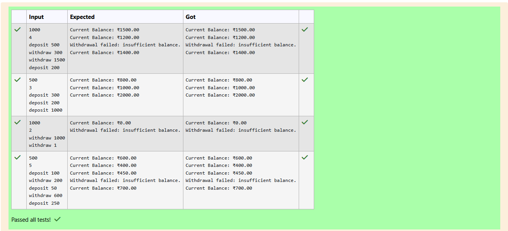

# Ex.No:4(D) DESIGN PATTERN  ---- BEHAVIOUR PATTERN

## QUESTION:

Write a small Java MVC program to track a Bank Account balance. Controller can deposit and withdraw, and the view should show the updated balance. (MVC Pattern)
## AIM:

To implement a Bank Account system using the Model–View–Controller (MVC) design pattern in Java.

The program should allow deposits, withdrawals, and balance display with proper separation of concerns.


## ALGORITHM :

1. Model (BankAccount)
    * Declare a private variable balance.
    * Create a constructor to initialize the balance.
    * Implement methods:
        * deposit(double amount) → adds to balance if amount > 0.
        * withdraw(double amount) → deducts from balance if sufficient funds exist, else returns false.
        * getBalance() → returns current balance.
2. View (AccountView)
    * Implement showBalance(double balance) → prints balance in formatted style.
    * Implement showError(String message) → prints error messages.
3. Controller (AccountController)
    * Holds references to BankAccount (model) and AccountView (view).
    * Provides methods:
        * deposit(double amount) → updates model and shows balance via view.
        * withdraw(double amount) → updates model, shows balance if successful, else shows error.
        * showBalance() → displays current balance.
4. Main Program
    * Read initial balance.
    * Create objects of BankAccount, AccountView, and AccountController.
    * Read number of operations.
    * For each operation:
        * If "deposit", call controller.deposit(amount).
        * If "withdraw", call controller.withdraw(amount).
    * End program.


## PROGRAM:
 ```
/*
Program to implement a Behaviour Pattern using Java
Developed by: Elavarasan M
RegisterNumber:  212224040083
*/
```

## SOURCE CODE:

```java
import java.util.*;

public class BankMVCSkeleton {

    // Model
    static class BankAccount {
        // TODO: Add private balance variable and methods: deposit, withdraw, getBalance
        private double balance;
        
        public BankAccount(double initialBalance){
            this.balance = initialBalance;
        }
        
        public void deposit(double amount){
            if(amount > 0) balance+=amount;
        }
        
        public boolean withdraw(double amount){
            if(amount>0 && balance >=amount){
                balance-=amount;
                return true;
            }
            return false;
        }
        
        public double getBalance(){
            return balance;
        }
    }

    // View
    static class AccountView {
        // TODO: Add method to show balance and show error
        public void showBalance(double balance){
            System.out.printf("Current Balance: ₹%.2f\n",balance);
        }
        public void showError(String message){
            System.out.println(message);
        }
    }

    // Controller
    static class AccountController {
        // TODO: Add constructor, deposit, withdraw, and showBalance methods
        private BankAccount account;
        private AccountView view;
        
        public AccountController(BankAccount account,AccountView view){
            this.account = account;
            this.view = view;
        }
        public void deposit(double amount){
            account.deposit(amount);
            view.showBalance(account.getBalance());
        }
        
        public void withdraw(double amount){
            boolean success = account.withdraw(amount);
            if(success){
                view.showBalance(account.getBalance());
            }
            else{
                view.showError("Withdrawal failed: insufficient balance.");
            }
        }
        
        public void showBalance(){
            view.showBalance(account.getBalance());
        }
    }

    public static void main(String[] args) {
        Scanner sc = new Scanner(System.in);

        double initialBalance = sc.nextDouble();
        BankAccount model = new BankAccount(initialBalance);
        AccountView view = new AccountView();
        AccountController controller = new AccountController(model, view);

        int operations = sc.nextInt();
        for (int i = 0; i < operations; i++) {
            String op = sc.next();
            double amount = sc.nextDouble();
            if (op.equalsIgnoreCase("deposit")) {
                controller.deposit(amount);
            } else if (op.equalsIgnoreCase("withdraw")) {
                controller.withdraw(amount);
            }
        }

        sc.close();
    }
}

```


## OUTPUT:




## RESULT:
The program successfully demonstrates the MVC pattern in a banking system.