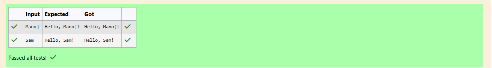

# Ex.No:5(A) INPUTSTREAMREADER 

## QUESTION:

Write a program to read user input from the keyboard using InputStreamReader 

## AIM:

To write a Java program that demonstrates reading input using BufferedReader and handling exceptions with a try-catch block.

## ALGORITHM :

1. Import required classes: Scanner, InputStreamReader, BufferedReader, and IOException.
2. In the main method:
    * Create a BufferedReader object using InputStreamReader(System.in).
    * Read a line of input using readLine().
    * Print "Hello, [input]!".
3. Use a try-with-resources block to automatically close the BufferedReader.
4. Catch any IOException and print the error message.
5. End the program.


## PROGRAM:
 ```
/*
Program to implement a InputStreamReader using Java
Developed by: Elavarasan M
RegisterNumber:  212224040083
*/
```

## SOURCE CODE:

```java
import java.util.Scanner;
import java.io.InputStreamReader;
import java.io.BufferedReader;
import java.io.IOException;

public class Main{
    public static void main(String[] args){
        try(BufferedReader bf = new BufferedReader(new InputStreamReader(System.in))){
            String input = bf.readLine();
            System.out.print("Hello, " + input + "!");
        }
        catch(IOException e){
            System.out.println(e.getMessage());
        }
    }
}
```


## OUTPUT:




## RESULT:

The program successfully reads input using BufferedReader and prints a greeting message.