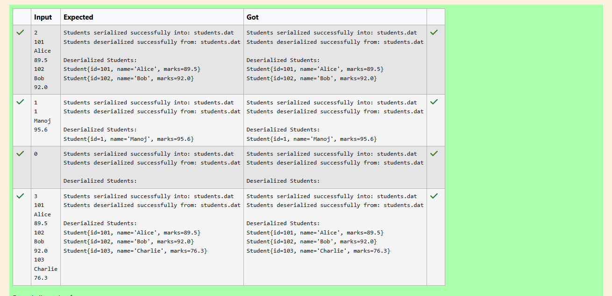

# Ex.No:5(B) SERIALIZATION AND DESERIALIZATION 

## QUESTION:

Write a Java program to serialize a collection of objects (like ArrayList<Student>) into a file.

## AIM:

To write a Java program that demonstrates object serialization and deserialization using the Serializable interface.

The program should allow user input of student details, serialize them into a file, and then deserialize them back for display.

## ALGORITHM :

1. Define a Student class that implements Serializable.
    * Add attributes: id, name, and marks.
    * Provide a constructor to initialize these attributes.
    * Override toString() to display student details.
2. In the StudentSerializationUserInput class:
    * Implement serializeStudents(List<Student>, String fileName) method
        * Create an ObjectOutputStream with FileOutputStream.
        * Write the list of students to the file.
        * Handle IOException.
    * Implement deserializeStudents(String fileName) method:
        * Create an ObjectInputStream with FileInputStream.
        * Read the list of students from the file.
        * Handle IOException and ClassNotFoundException.
3. In the main method:
    * Read the number of students n.
    * For each student, read id, name, and marks.
    * Add each student to a list.
    * Call serializeStudents() to save the list into a file (students.dat).
    * Call deserializeStudents() to read the list back from the file.
    * Print the deserialized student details.
4. End the program.


## PROGRAM:
 ```
/*
Program to implement a Serialization and Deserialization using Java
Developed by: Elavarasan M
RegisterNumber:  212224040083
*/
```

## SOURCE CODE:

```java
import java.io.*;
import java.util.*;

// Student class must implement Serializable
class Student implements Serializable {
    private static final long serialVersionUID = 1L;

    private int id;
    private String name;
    private double marks;

    public Student(int id, String name, double marks) {
        this.id = id;
        this.name = name;
        this.marks = marks;
    }

    @Override
    public String toString() {
        return "Student{id=" + id + ", name='" + name + "', marks=" + marks + "}";
    }
}

public class StudentSerializationUserInput {

    // Serialize list of students
    public static void serializeStudents(List<Student> students, String fileName) {
        try (ObjectOutputStream oos = new ObjectOutputStream(new FileOutputStream(fileName))) {
            oos.writeObject(students);
            System.out.println("Students serialized successfully into: " + fileName);
        } catch (IOException e) {
            System.out.println("Error during serialization: " + e.getMessage());
        }
    }

    // Deserialize list of students
    @SuppressWarnings("unchecked")
    public static List<Student> deserializeStudents(String fileName) {
        List<Student> students = null;
        try (ObjectInputStream ois = new ObjectInputStream(new FileInputStream(fileName))) {
            students = (List<Student>) ois.readObject();
            System.out.println("Students deserialized successfully from: " + fileName);
        } catch (IOException | ClassNotFoundException e) {
            System.out.println("Error during deserialization: " + e.getMessage());
        }
        return students;
    }

    public static void main(String[] args) {
        Scanner scanner = new Scanner(System.in);
        List<Student> students = new ArrayList<>();

        int n = scanner.nextInt();
        scanner.nextLine(); // consume newline

        for(int i=0;i<n;i++){
            int id = scanner.nextInt();
            scanner.nextLine();
            String name = scanner.nextLine();
            double marks = scanner.nextDouble();
            scanner.nextLine();
            
            students.add(new Student(id,name,marks));
        }
        
        String filename = "students.dat";
        serializeStudents(students,filename);
        List<Student> deserializedStudents = deserializeStudents(filename);
        // Write your code here

        // Display deserialized data
        if (deserializedStudents != null) {
            System.out.println("\nDeserialized Students:");
            for (Student s : deserializedStudents) {
                System.out.println(s);
            }
        }

        scanner.close();
    }
}

```


## OUTPUT:



## RESULT:

The program successfully demonstrates serialization and deserialization of student objects.