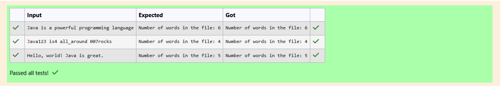

# Ex.No:5(C)  FILE HANDLING USING JAVA
## QUESTION:

Read a file and print only the lines containing the word "Java".
## AIM:

To write a Java program that demonstrates file handling using FileWriter and BufferedReader.

The program should allow the user to write multiple lines into a file and then read and display only those lines containing the word "Java".

## ALGORITHM :


1. Create a Scanner object to read input from the user.
2. Define a filename (example.txt) and a target word (Java).
3. Use a FileWriter inside a try-with-resources block:
    * Continuously read lines from the user.
    * Write each line into the file followed by a newline.
    * Stop when the user enters "exit".
4. Use a BufferedReader inside another try-with-resources block:
    * Read each line from the file.
    * If the line contains the target word "Java", print it.
5. Handle any IOException using a catch block.
6. End the program.


## PROGRAM:
 ```
/*
Program to implement a File Handling using Java
Developed by: Elavarasan M
RegisterNumber:  212224040083
*/
```

## SOURCE CODE:

```java
import java.util.Scanner;
import java.io.*;
public class Main{
    public static void main(String[] args){
        Scanner sc = new Scanner(System.in);
        String filename = "example.txt";
        String target = "Java";
        try(FileWriter fw = new FileWriter(filename)){
            while(true){
                String word = sc.nextLine();
                fw.write(word);
                fw.write('\n');
                if(word.equals("exit")){ break; }
            }
        }
        catch(IOException e){
            System.out.println(e.getMessage());
        }
        
        try(BufferedReader bf = new BufferedReader(new FileReader(filename))){
            String line;
            System.out.println("Lines containing the word 'Java':");
            while((line = bf.readLine()) != null){
                if(line.contains(target)){
                    System.out.println(line);
                }
            }
        }
        catch(IOException e){
            System.out.println(e.getMessage());
        }
    }
}
```


## OUTPUT:




## RESULT:

The program successfully writes user input into a file and retrieves only the lines containing "Java".
