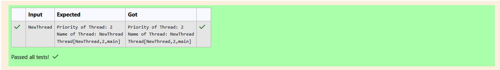

# Ex.No:5(D) THREAD PRIORITY

## QUESTION:

Write a java program for set the priority and name of the current thread.

Note : Read the threadname from the User

Set the Priority as 2.

## AIM:

To write a Java program that demonstrates thread creation using Thread class, setting thread priority, and assigning a thread name.

## ALGORITHM :

1. Define a class MyThread that extends Thread.
    * Override the run() method.
    * Inside run(), print:
        * The priority of the thread (getPriority()).
        * The name of the thread (getName()).
        * The thread object itself (this).
2. In the main method:
    * Create a Scanner object to read input.
    * Read a string name from the user.
    * Create an object t of MyThread.
    * Set the thread priority to 2 using setPriority().
    * Set the thread name using setName(name).
    * Start the thread using start().
    * Close the scanner.
3. End the program.


## PROGRAM:
 ```
/*
Program to implement a Thread Priority Concept using Java
Developed by: Elavarasan M
RegisterNumber:  212224040083
*/
```

## SOURCE CODE:


```java
import java.util.Scanner;
class MyThread extends Thread{
    public void run(){
        System.out.println("Priority of Thread: " + this.getPriority());
        System.out.println("Name of Thread: " + this.getName());
        System.out.println(this);
    }
}

public class Main{
    public static void main(String[] args){
        Scanner sc = new Scanner(System.in);
        
        String name = sc.next();
        MyThread t = new MyThread();
        t.setPriority(2);
        t.setName(name);
        
        t.start();
        sc.close();
    }
}
```


## OUTPUT:



## RESULT:

The program successfully demonstrates thread creation, naming, and priority assignment.